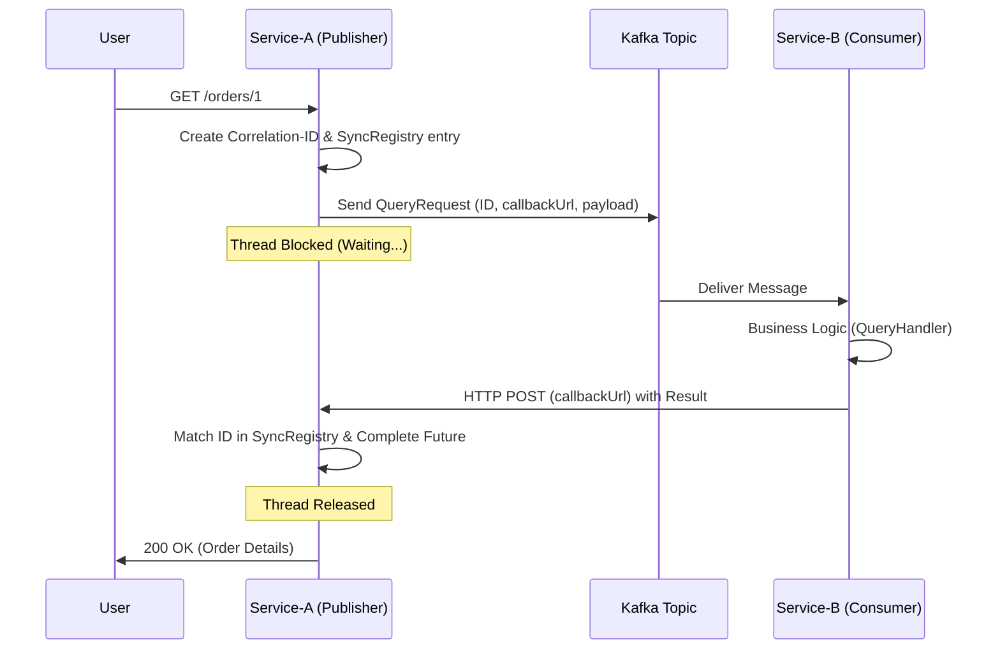

# Splitr: Distributed Synchronous Query Bus

**Splitr** is a lightweight, high-performance Spring Boot library designed to implement the **Request-Response pattern over Kafka**. It allows microservices to execute synchronous, typed queries across distributed boundaries while maintaining idempotency and resilience.

---

## 🔄 How It Works (Workflow)

Splitr bridges the gap between asynchronous messaging and synchronous execution requirements.

1. **Request (Service-A):**
* Generates a unique **Correlation-ID**.
* Registers a promise in the internal `SyncRegistry` and blocks the executing thread.
* Publishes a `QueryRequest` to Kafka, containing the payload and a `callbackUrl`.


2. **Processing (Service-B):**
* `QueryKafkaListener` consumes the message.
* The `IdempotencyStore` checks if this ID was processed before to prevent duplicate execution.
* The `QueryDispatcher` routes the query to the specific `QueryHandler<T>`.


3. **Callback & Completion:**
* Service-B sends the result via an HTTP POST to Service-A’s `callbackUrl`.
* Service-A’s `QueryCallbackController` receives the result, matches the Correlation-ID, and unblocks the original thread.




---

## 🚀 Features

* **Synchronous over Kafka:** Blocking local threads for remote responses, mimicking REST over message brokers.
* **Automatic Dispatching:** Just implement `QueryHandler<T>`, and Splitr handles the routing.
* **Idempotency Engine:** Built-in LRU cache to prevent "at-least-once" delivery side effects.
* **Type Safety:** Full support for polymorphic queries via Jackson Type Headers.
* **Configurable Timeouts:** Global or per-request timeout management.

---

## 📦 Installation & Configuration

### 1. Publisher Side (Service A)

Enable the bus and specify where to receive results.

```yaml
splitr:
  publisher:
    enabled: true
  callback-url: http://service-a:8080/internal/query/callback
  bus:
    kafka:
      topic: tr.kontas.splitr.query.topic
    default-timeout: 5000 # ms

```

### 2. Consumer Side (Service B)

Enable the processor and set idempotency limits.

```yaml
splitr:
  consumer:
    enabled: true
  idempotency:
    max-size: 1000

```

---

## 🛠 Usage

### Step 1: Define Your Query

```java
public record OrderQuery(String orderId) { }

```

### Step 2: Implement the Handler (Consumer)

```java
@Component
public class OrderQueryHandler implements QueryHandler<OrderQuery> {
    @Override
    public Class<OrderQuery> type() { return OrderQuery.class; }

    @Override
    public Object handle(OrderQuery q) {
        return "ORDER-DETAILS-" + q.orderId();
    }
}

```

### Step 3: Execute the Query (Publisher)

```java
@RestController
@RequiredArgsConstructor
public class OrderController {
    private final QueryBus queryBus;

    @GetMapping("/order/{id}")
    public String get(@PathVariable String id) {
        return queryBus.querySync(new OrderQuery(id), String.class);
    }
}

```

---

## ⚙️ Configuration Properties

| Property | Default | Description |
| --- | --- | --- |
| `splitr.publisher.enabled` | `false` | Enables QueryBus and Callback endpoint. |
| `splitr.consumer.enabled` | `false` | Enables Kafka listeners and Dispatcher. |
| `splitr.callback-url` | - | The HTTP endpoint for the publisher's callback. |
| `splitr.bus.default-timeout` | `10` | Default wait time in ms for sync queries. |
| `splitr.idempotency.max-size` | `100` | Size of the LRU cache for duplicate detection. |

---

## 📑 Roadmap & TODO's

### 🚀 High Priority (Core Engine)

* [x] **Query Bus:** Distributed request-response pattern.
* [ ] **Command Bus:** Asynchronous command dispatching.
* [ ] **Event Bus:** Pub/Sub broadcast support.
* [ ] **DLQ (Dead Letter Queue):** Automatic failure routing to `.DLT` topics.
* [ ] **Saga Support:** Orchestration for distributed transactions.

### 🛡 Resilience & Security

* [ ] **Circuit Breaker:** Resilience4j integration for callback failures.
* [ ] **Payload Encryption:** AES encryption for Kafka records.
* [ ] **Validation:** JSR-303 support for Query/Command DTOs.

### 📊 Observability

* [ ] **Distributed Tracing:** Micrometer/Zipkin integration for Correlation-IDs.
* [ ] **Metrics:** Prometheus/Grafana dashboard for latency monitoring.

### 💾 Storage & Transports

* [x] **Kafka Support:** Default transport layer.
* [ ] **Redis Idempotency:** Distributed store for horizontal scaling.
* [ ] **RabbitMQ Support:** Alternative AMQP transport.

---

## 🤝 Contributing

Developed and maintained by **BurakKontas**. Feel free to submit issues or pull requests to improve the bus performance or add new features.
