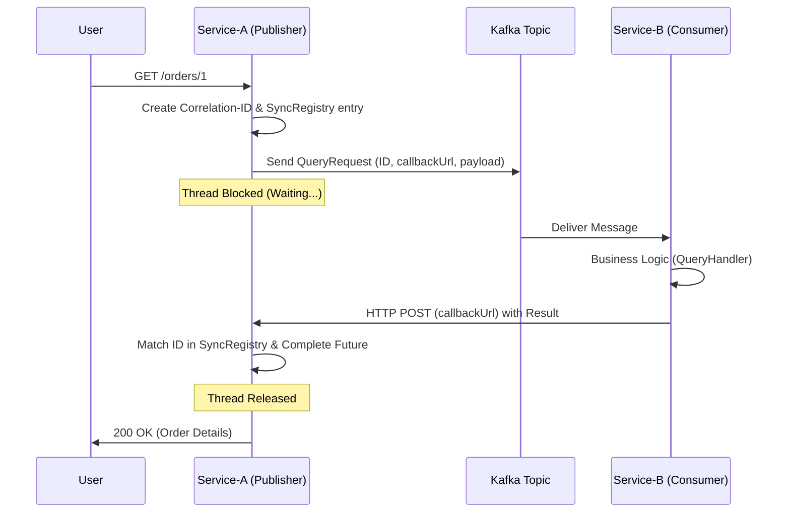

# Splitr: Distributed Synchronous Query Bus

**Splitr** is a lightweight, high-performance Spring Boot library designed to implement the **Request-Response pattern over Kafka**. It allows microservices to execute synchronous, typed queries across distributed boundaries while maintaining idempotency and resilience.

---

## 🔄 How It Works (Workflow)

Splitr bridges the gap between asynchronous messaging and synchronous execution requirements.

1. **Request (Service-A):**
* Generates a unique **Correlation-ID**.
* Registers a promise in the internal `SyncRegistry` and blocks the executing thread.
* Publishes a `QueryRequest` to Kafka, containing the payload and a `callbackUrl`.


2. **Processing (Service-B):**
* `QueryKafkaListener` consumes the message.
* The `IdempotencyStore` checks if this ID was processed before to prevent duplicate execution.
* The `QueryDispatcher` routes the query to the specific `QueryHandler<T>`.


3. **Callback & Completion:**
* Service-B sends the result via an HTTP POST to Service-A’s `callbackUrl`.
* Service-A’s `QueryCallbackController` receives the result, matches the Correlation-ID, and unblocks the original thread.

Note: Command workflow is same with query.



---

## 🚀 Features

* **Synchronous over Kafka:** Blocking local threads for remote responses, mimicking REST over message brokers.
* **Automatic Dispatching:** Just implement `QueryHandler<T>`, and Splitr handles the routing.
* **Idempotency Engine:** Built-in LRU cache to prevent "at-least-once" delivery side effects.
* **Type Safety:** Full support for polymorphic queries via Jackson Type Headers.
* **Configurable Timeouts:** Global or per-request timeout management.

---

## 📦 Installation & Configuration

### 1. Publisher Side (Service A)

Enable the bus and specify where to receive results.

```yaml
splitr:
  publisher:
    enabled: true
  callback-url: http://service-a:8080/internal/query/callback
  bus:
    kafka:
      topic: tr.kontas.splitr.query.topic
    default-timeout: 5000 # ms

```

### 2. Consumer Side (Service B)

Enable the processor and set idempotency limits.

```yaml
splitr:
  consumer:
    enabled: true
  idempotency:
    max-size: 1000 # record size

```

---

## 🛠 Usage

### Step 1: Define Your Query

```java
public record OrderQuery(String orderId) { }

```

### Step 2: Implement the Handler (Consumer)

```java
@Component
public class OrderQueryHandler implements QueryHandler<OrderQuery> {
    @Override
    public Class<OrderQuery> type() { return OrderQuery.class; }

    @Override
    public Object handle(OrderQuery q) {
        return "ORDER-DETAILS-" + q.orderId();
    }
}

```

### Step 3: Execute the Query (Publisher)

```java
@RestController
@RequiredArgsConstructor
public class OrderController {
    private final QueryBus queryBus;

    @GetMapping("/order/{id}")
    public String get(@PathVariable String id) {
        return queryBus.publishSync(new OrderQuery(id), String.class);
    }
}

```

---

## ⚙️ Configuration Properties

| Property                         | Default                          | Description                                          |
|----------------------------------|----------------------------------|------------------------------------------------------|
| `splitr.publisher.enabled`       | `false`                          | Enables QueryBus and Callback endpoint.              |
| `splitr.consumer.enabled`        | `false`                          | Enables Kafka listeners and Dispatcher.              |
| `splitr.callback-url`            | - (Required)                     | The HTTP endpoint for the publisher's callback.      |
| `splitr.bus.default-timeout`     | `10000`                            | Default wait time in ms for sync query and commands. |
| `splitr.bus.kafka.command.topic` | `tr.kontas.splitr.command.topic` | Kafka Command topic.                                 |
| `splitr.bus.kafka.query.topic`   | `tr.kontas.splitr.query.topic`   | Kafka query topic.                                   |

---

Yol haritasını (Roadmap) hem görsel olarak daha profesyonel bir hale getirdim hem de **DLQ Jobs** kısmını tam istediğin "cron tabanlı yeniden deneme" (Retry Mechanism) detaylarıyla genişlettim.

---

Roadmap'i her madde için teknik derinlik ve stratejik notlar ekleyerek güncelledim. Özellikle **DLQ Jobs** ve **Idempotency** gibi kritik kısımları mimari gereksinimlerine göre detaylandırdım.

---

## 📑 Roadmap & TODO's

### 🚀 High Priority (Core Engine)

* [x] **Query Bus:** Distributed request-response pattern.
* [x] **Command Bus:** Asynchronous command dispatching.
* [ ] **Event Bus:** Pub/Sub broadcast support for domain events.
  * *Note:* Fan-out pattern implementation. Multiple listeners for a single event with independent consumer groups.
* [ ] **Dead Letter Queue (DLQ):** Automatic failure routing to `.DLT` topics for commands and events.
  * *Note:* Catch-all error handling in listeners to prevent infinite retry loops and partition blocking.
* [ ] **DLQ Retry Jobs:** Scheduled background jobs to consume from DLQ and re-publish to main topics.
  * *Customization:* User-defined **Cron Expressions** for retry intervals.
  * *Logic:* Smart back-off strategy; use `x-retry-count` headers to prevent "poison pill" messages from circulating forever.
* [ ] **Saga Support:** Orchestration-based distributed transaction management.
  * *Note:* State machine implementation to manage compensations (undo operations) when a step in the flow fails.

### 🛡 Resilience & Security

* [ ] **Idempotency Guard:** Distributed store to prevent duplicate processing.
  * *Note:* Redis-backed check for `Message-ID` before execution. Essential for "at-least-once" delivery guarantees in Kafka.
* [ ] **Circuit Breaker:** Resilience4j integration to protect the bus.
  * *Note:* Automatically trip the circuit if the `callback-url` or target microservice is down, preventing resource exhaustion.
* [ ] **Payload Encryption:** Optional AES encryption for sensitive Kafka record data.
  * *Note:* Field-level or full-body encryption to ensure PII (Personally Identifiable Information) security at rest in Kafka brokers.
* [ ] **Schema Validation:** JSR-303 (Hibernate Validator) support for incoming DTOs.
  * *Note:* Fail-fast mechanism; validate the command/query payload before it ever touches the Kafka topic.

### 📊 Observability

* [ ] **Distributed Tracing:** Micrometer/Brave/Zipkin integration.
  * *Note:* Propagation of `Span-ID` and `Trace-ID` across different services to visualize the entire request flow.
* [ ] **Metrics & Dashboards:** Micrometer-based Prometheus metrics.
  * *Note:* Real-time tracking of "Bus Throughput", "Average Response Latency", and "DLQ Error Rates".
* [ ] **Audit Log:** Persistent storage for all dispatched messages.
  * *Note:* A separate database or search index (Elasticsearch) to search historical commands and see who triggered what, when.

### 💾 Storage & Transports

* [x] **Kafka Transport:** Primary high-throughput transport layer.
* [ ] **RabbitMQ Transport:** AMQP-based alternative.
  * *Note:* Support for environments where lightweight broker logic and complex routing (Exchange types) are preferred.
* [ ] **Redis Sync Registry:** Distributed state for horizontal scaling.
  * *Note:* Necessary when the `SyncRegistry` needs to be shared across multiple instances of the same service to handle response callbacks.

---

## 🤝 Contributing

Developed and maintained by **BurakKontas**. Feel free to submit issues or pull requests to improve the bus performance or add new features.
